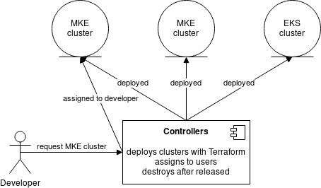
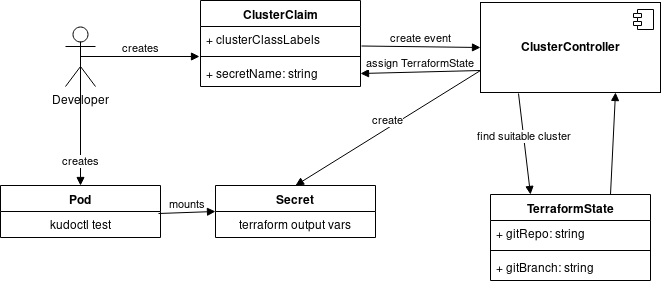
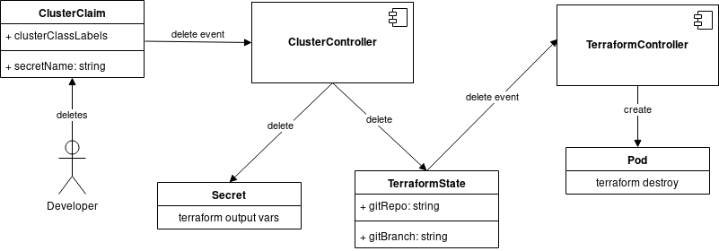

# Ephemeral End-to-End Test Environments

## Table of Contents

* [Summary](#summary)
* [Motivation](#motivation)
   * [Goals](#goals)
   * [Non-Goals](#non-goals)
* [Proposal](#proposal)
   * [User Stories](#user-stories)
   * [Implementation Details](#implementation-details)
      * [Deploying Terraform test environments](#deploying-terraform-test-environments)
      * [Maintaining an idle pool of environments](#maintaining-an-idle-pool-of-environments)
      * [Claiming a test environment](#claiming-a-test-environment)
      * [Deleting a test environment](#deleting-a-test-environment)
   * [Risks and Mitigations](#risks-and-mitigations)
* [Graduation Criteria](#graduation-criteria)
* [Implementation History](#implementation-history)
* [Alternative Solutions](#alternative-solutions)
* [Infrastructure Needed](#infrastructure-needed)

## Summary

This document describes how test environments will be provisioned in CI for use in end-to-end testing of KUDO and Frameworks.

A KUDO Framework will be built that can manage idle pools of Terraform-provisioned Kubernetes clusters - ensuring that CI jobs always have Kubernetes available to use for tests without waiting to provision them.



## Motivation

Kubernetes clusters can take a long time to provision. A very fast provider (e.g. [kind](https://github.com/kubernetes-sigs/kind)) can provision one in under a minute, but very slow providers can take up to half an hour.

According to KEP-0004, it is important to KUDO and Frameworks across many Kubernetes providers to ensure compatibility across all major providers. This will lead to a lot of time spent in CI provisioning Kubernetes clusters - which is not what we are trying to test.

Beyond just taking a long time to provision, cluster provisioning can be flaky and introduce delays or failures to builds that are unrelated to the thing being tested.

By ensuring that a pool of idle, ephemeral Kubernetes clusters are always available, we can test everywhere we want to and avoid flakiness and delays.

### Goals

* Support using any Terraform-provisioned infrastructure as part of a test job.
* Mitigate wait times caused by deployment of testing environments.
* Support easy testing of Terraform modules.

### Non-Goals

* Optimizing cluster start up times.
* Choosing cloud providers for test environments.
* Building Kubernetes cluster management or deployment tools.

## Proposal

[Terraform](http://terraform.io/) will be used to provision Kubernetes clusters and other infrastructure for use in test jobs. With Terraform, we can provision Kubernetes clusters in every major provider, as well as on-premise. As Terraform is a general purpose infrastructure as code tool, we are also not limited to provisioning Kubernetes clusters.

We create a Terraform Kubernetes controller ("TerraformController") to manage Terraform state directly in Kubernetes. With it, we can create new Terraform deployments, delete Terraform deployments, and fetch their outputs natively in Kubernetes.

The TerraformController consumes Terraform modules from Git, which allows maintaining Terraform modules for each test environment in a Git repository.

To ensure that a minimum number of test environments are always ready to use, a Kubernetes controller (called "ClusterController") will be created to assign test environments to CI jobs and create new ones when necessary.

These controllers will live in the same cluster as Prow, making it very easy to integrate with new jobs.

### User Stories

* As a KUDO developer, I do not want to wait for test environments to be provisioned.
* As a KUDO developer and Framework developer, I want to test KUDO and KUDO Frameworks across many different test environments.

### Implementation Details

#### Deploying Terraform test environments


The TerraformController watches for `TerraformState` objects to be created that describe a Terraform module to load and its parameters:

```
type TerraformState struct {
	TypeMeta
	ObjectMeta
	Spec       TerraformStateSpec
}

type TerraformStateSpec struct {
	// The git repository to fetch the Terraform module from.
	TerraformModuleGitRepository string
	// The git branch to fetch the Terraform module from.
	TerraformModuleGitBranch     string
	// A list of Kubernetes secrets containing Terraform variables to use with the Terraform module.
	TerraformVariablesSecrets    []string
}

type TerraformStateStatus struct {
	Status  TerraformStatus
	Errors  []string
	Outputs map[string]string
}

type TerraformStatus string

const (
	APPLYING   TerraformStatus = "APPLYING"
	COMPLETED  TerraformStatus = "COMPLETED"
	FAILED     TerraformStatus = "FAILED"
	DESTROYING TerraformStatus = "DESTROYING"
)
```

Once a `TerraformState` object is created, the TerraformController creates a Kubernetes `Pod` that runs `terraform apply` to deploy the module. When the Terraform module has completed running, the TerraformController updates the `TerraformState` object with the Terraform output variables.

The Terraform module should output the required details necessary to connect to the cluster as output variables, e.g., the kubernetes configuration file.

Once the `TerraformState` object is deleted, the TerraformController creates a Kubernetes `Pod` that runs `terraform destroy` to clean up the deployed infrastructure.

#### Maintaining an idle pool of environments

Since test environments can be created simply by creating a `TerraformState` object, to maintain an idle pool of test environments, a controller needs to be created that can assign test environments to jobs and create new `TerraformState` objects when there are not enough unassigned jobs.

To create an idle pool of environments, the CI job maintainer creates a `ClusterClass` object describing the test environment.

```
type ClusterClass struct {
	TypeMeta
	ObjectMeta
	Spec       ClusterClassSpec
}

type ClusterClassSpec struct {
	// The minimum number of unallocated clusters that should be available at any time.
	MinimumAvailable             int
	// The maximum number of clusters that should exist at any given time.
	Maximum                      int
	// The git repository to fetch the Terraform module from.
	TerraformModuleGitRepository string
	// The git branch to fetch the Terraform module from.
	TerraformModuleGitBranch     string
	// A list of Kubernetes secrets containing Terraform variables to use with the Terraform module.
	TerraformVariablesSecrets    []string
}

type ClusterClassStatus struct {
	Existing int
	Assigned int
}
```

The `ClusterController` watches for `ClusterClasses` to exist and then ensures that the proper number of `TerraformState` objects always exist:

* If there are `maximum` `TerraformStates` already existing, it does nothing - even if there are not `minimumAvailable` `TerraformStates` unassigned.
* If there are less than `minimumAvailable` `TerraformStates` unassigned, then it creates a new `TerraformState`.

The `ClusterClass` should have labels set in the metadata indicating details about the cluster, e.g., provider, region, size. These labels are used by `ClusterClaims` to select cluster classes.

#### Claiming a test environment



A test environment (`TerraformState`) can be claimed by creating a `ClusterClaim` object describing the desired cluster:

```
type ClusterClaim struct {
	TypeMeta
	ObjectMeta
	Spec       ClusterClaimSpec
	Status     ClusterClaimStatus
}

type ClusterClaimSpec struct {
	Secret            string
	// A label selector for filtering ClusterClasses.
	ClusterLabels     metav1.LabelSelector
}

type ClusterClaimStatus struct {
	TerraformState metav1.ObjectReference
}
```

The ClusterController then checks if there is an unassigned `TerraformState` object available for a `ClusterClass` matching the `ClusterClaim`'s label selector. If there is not one, then it waits for one to exist.

Once a `TerraformState` exists, then the ClusterController updates the `ClusterClaim` with a reference to the `TerraformState` and creates a Kubernetes `Secret` object containing all of the output variables of a Terraform deployment. These `Secrets` are mounted into test pods where they can be consumed by tests.

Because Kubernetes waits for a referenced `Secret` to exist prior to starting a pod and the `ClusterClaim` provides the name of the `Secret` to create, the CI job can create the `ClusterClaim` and test `Pod` simultaneously and Kubernetes will start the `Pod` as soon as the `Secret` is created by the `ClusterController`.

#### Deleting a test environment



Once a test environment is no longer needed, the `ClusterClaim` object can be deleted. Once it is, the ClusterController deletes the `TerraformState` which causes the test environment to be deleted.

### Risks and Mitigations

* The Terraform controller might forget about clusters or lose resources. CloudCleaner is a tool built by Mesosphere than can ensure that resources are always deleted after some time.
* Wasted resources if an idle pool is too large - we might consider a tool that can automatically adjust the `minimumAvailable` settings on the `ClusterClass` based on time of day or metrics.

## Graduation Criteria

* Kubernetes clusters can be provisioned for use in CI jobs.

## Implementation History

* 2019/06/21 - Wrote KEP.

## Alternative Solutions

* An alternative solution is to create namespaces for each test in existing Kubernetes clusters. While this works, it adds maintenance overhead in ensuring that the long running test cluster is always healthy and that tests do not collide over resources or names. This approach is taken by [acyl](https://github.com/dollarshaveclub/acyl).
* [Kubernaut](https://github.com/datawire/kubernaut) implements a similar API, but it is not well documented or maintained and appears to not be as flexible (it does not leverage Terraform to deploy clusters).

## Infrastructure Needed

* Prow cluster
* Accounts on cloud providers used for tests.
